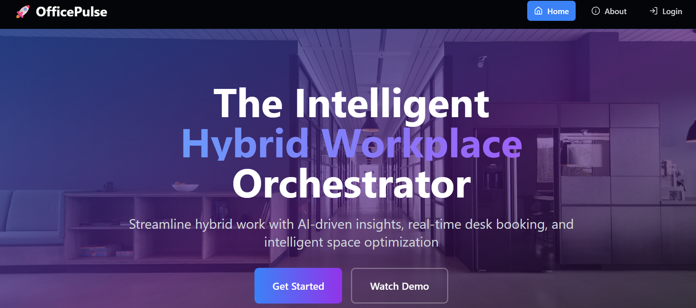

# OfficePulse: Intelligent Hybrid Workplace Orchestrator 🏢💡

  

Welcome to **OfficePulse**, a next-generation smart office dashboard designed to streamline hybrid work environments with AI-driven insights, real-time desk booking, and secure, role-based access. Built with cutting-edge technologies, OfficePulse optimizes space utilization, enhances team coordination, and ensures a seamless workplace experience.

## 🌟 Features

- **Real-Time Desk & Room Booking** 📅  
  Reserve desks or meeting rooms instantly with live availability updates via WebSockets.
- **AI-Powered Space Optimization** 🤖  
  Analyze usage patterns to maximize office efficiency with predictive analytics.
- **Employee Presence Analytics** 📊  
  Track in-office presence with interactive heatmaps and exportable reports.
- **Secure Role-Based Access** 🔒  
  JWT and Bcrypt ensure data security with role-specific permissions.
- **Live Emergency Alerts** 🚨  
  Full-screen alerts with evacuation routes for safety and compliance.

## 🛠️ Tech Stack

| **Layer**      | **Technology**              | **Purpose**                       |
|-----------------|-----------------------------|-----------------------------------|
| **Frontend**    | React + Tailwind CSS       | Responsive, modern UI design      |
| **State**       | Context API                | Complex state management          |
| **Backend**     | Node.js + Express          | RESTful API for data operations   |
| **Database**    | MongoDB + Mongoose         | Scalable data storage             |
| **Auth**        | JWT + Bcrypt              | Secure role-based authentication  |
| **Realtime**    | Socket.io                 | Live updates for bookings/alerts  |
| **DevOps**      | Docker + GitHub Actions    | Containerization & CI/CD          |
| **Hosting**     | Vercel (FE) + Render (BE)  | Zero-downtime deployments         |
